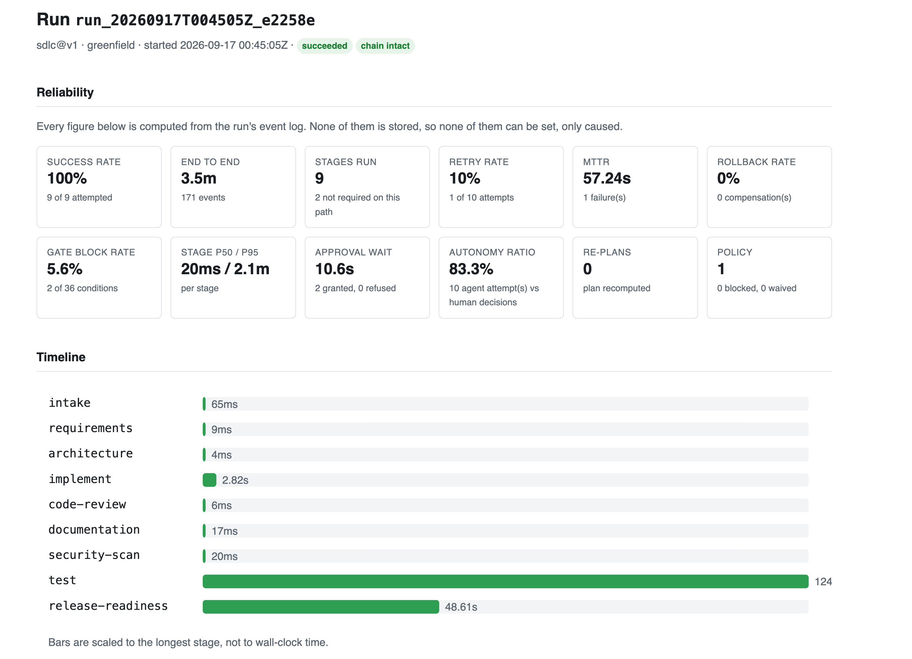
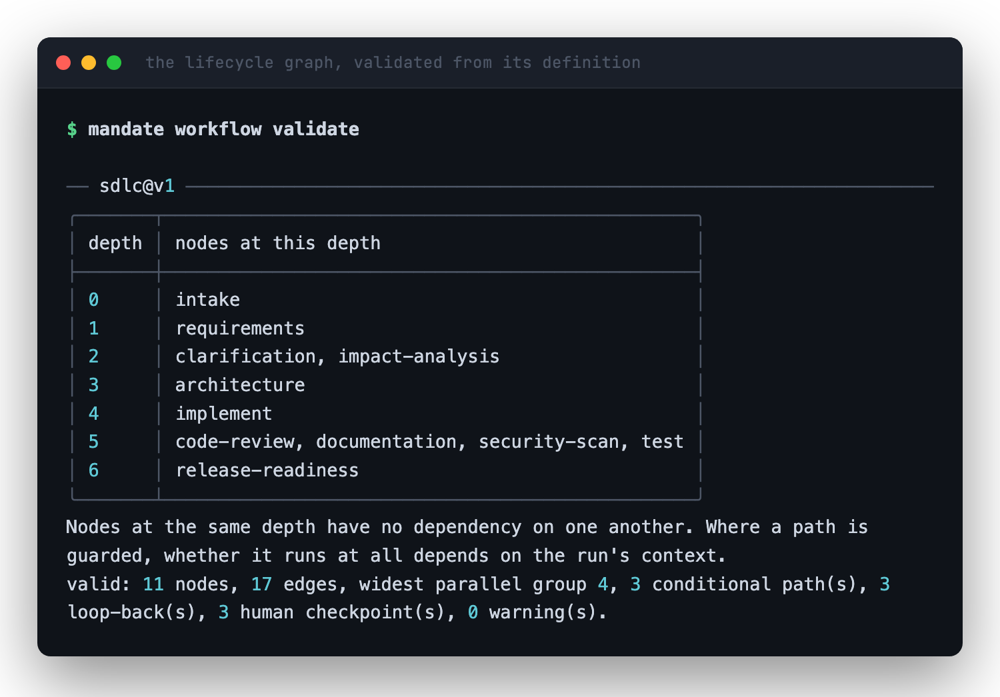
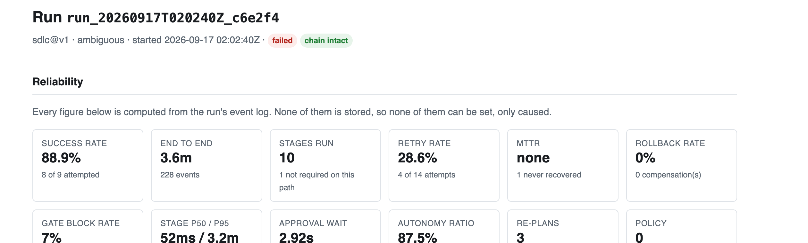
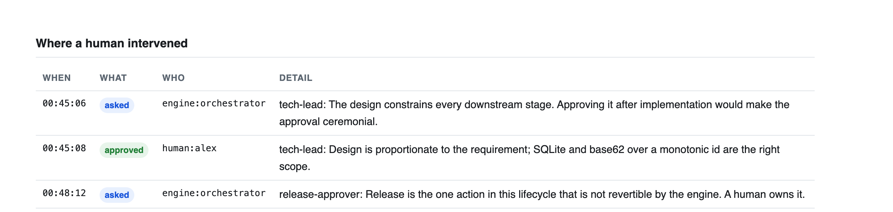
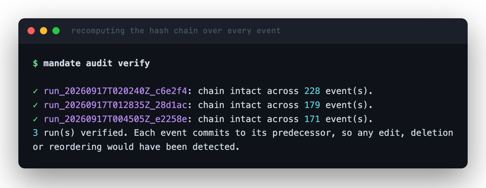
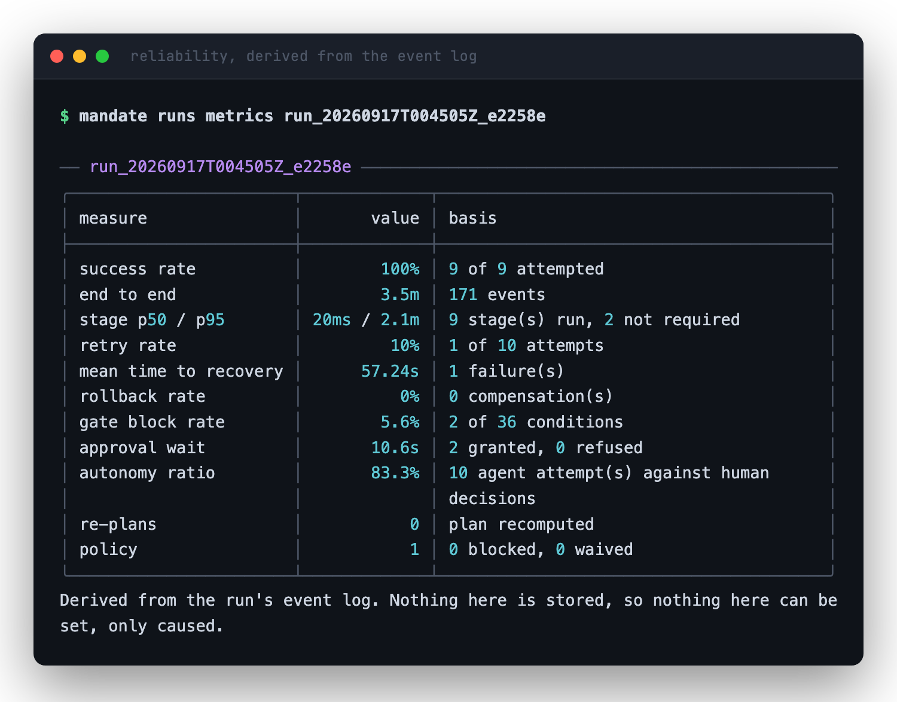

# Mandate

[](https://github.com/sumyuck/mandate-agentic-sdlc/actions/workflows/ci.yml)
[](global.json)
[](docs/TESTING.md)
[](LICENSE)

**A governed agentic software-engineering system.**

Mandate turns a requirement written in plain English into a reviewable engineering outcome.
It decomposes the work across an explicit dependency graph, has language models perform each
stage, holds their output to gates it cannot skip, stops for a named human at the decisions
that matter, and records every step in a log you can verify has not been altered.

> **Principle:** agents execute under a mandate; humans grant it, bound it, and revoke it.
>
> A *mandate* is the document stating exactly what an agent may and may not do on someone
> else's behalf: its limits, its prohibited actions, its reporting obligations. That is
> precisely what an autonomy boundary is, which is why the system is named for it.

The proving ground is a real service. The **URL shortener** in [`services/`](services/) was
written by Mandate, not by hand: its code, its tests, its OpenAPI contract, its architecture
decision record and its README. Two products in one repository. The orchestrator is the
deliverable; the service is the evidence that it works.

---

## Look at it first

**→ [sumyuck.github.io/mandate-agentic-sdlc](https://sumyuck.github.io/mandate-agentic-sdlc/)**

Three runs are recorded with their complete evidence committed. Each report is a
self-contained page — no scripts, no network — so you can read what the system did without
installing anything.

| | Run | Outcome | What it shows |
|---|---|---|---|
| **S1** | [Greenfield](https://sumyuck.github.io/mandate-agentic-sdlc/runs/run_20260917T004505Z_e2258e/report.html) | succeeded, 171 events | Decomposition, parallel execution behind a barrier, both human checkpoints, measured validation |
| **S2** | [Brownfield](https://sumyuck.github.io/mandate-agentic-sdlc/runs/run_20260917T012835Z_28d1ac/report.html) | succeeded, 179 events | Codebase reasoning over real code the system wrote, conditional routing that adds a stage, compensation on a real git tree |
| **S3** | [Ambiguous](https://sumyuck.github.io/mandate-agentic-sdlc/runs/run_20260917T020240Z_c6e2f4/report.html) | **held**, 228 events | Ambiguity scored and routed to a human, three re-plans, convergence from 0.35 to 0.1 — then stopped at the test gate |



Every figure there is recomputed from the run's event log on each read. None of them is
stored, so none of them can be set. It can only be caused.

---

## Try it in five minutes

No API key required. The model exchanges replay from committed recordings.

```bash
make demo
```

It checks the toolchain, builds, validates the lifecycle, proves the model layer offline,
walks all eleven stages with no key and no network, loads the three recorded runs and
verifies their audit chains. Or take the steps yourself:

```bash
make doctor                 # confirm the toolchain matches global.json
make verify                 # build with warnings as errors, 868 tests, style check
make workflow               # validate the lifecycle and show its parallel structure
make llm                    # prove the model layer works, offline
make run-model LLM=stub     # walk the whole lifecycle with no key and no network
make run FAIL=test-engineer # inject a failure and watch retry, fallback and rollback
```

Then read what the system actually did. The recorded runs are committed as evidence rather
than as a database, so the first command loads them into your local store:

```bash
dotnet run --project src/Mandate.Cli -- runs import runs
dotnet run --project src/Mandate.Cli -- runs list
dotnet run --project src/Mandate.Cli -- runs metrics run_20260917T004505Z_e2258e
dotnet run --project src/Mandate.Cli -- audit verify
```

Full command reference: [`docs/RUNBOOK.md`](docs/RUNBOOK.md).

---

## What makes it a governed system rather than an agent loop

Most agentic systems are a loop: call a model, look at the output, call it again. That works
until something goes wrong, and then there is nothing to inspect, no boundary that was
enforced, and no way to answer "why did it do that".

Five things are different here.

**The lifecycle is data, not code.** It lives in
[`workflows/sdlc.v1.yaml`](workflows/sdlc.v1.yaml) as a graph of stages, dependencies,
guards and gates. The engine knows nothing about software development. Changing how software
gets built is a configuration change under review, not a deployment.

**Agents propose; the engine applies.** No agent writes to the workspace. They return files
they would like written, and the engine validates every path and commits them as that
stage's commit. The autonomy boundary is enforced, not described.

**Claims are measured, not accepted.** A stage that says the tests pass does not define what
passing means. `dotnet build` and `dotnet test` run over the proposed tree before anything
is committed, and the measured figure replaces the claim. A stage that overstates its
results fails, naming both numbers. A stage whose verification produced *no* figure fails
too — it does not quietly fall back to the claim.

**Humans own the irreversible decisions.** The design everything is built on, and the
release itself, both require a named human who is not the requester. Approving work that
re-planning has since invalidated is impossible, because invalidation revokes the approval.

**The record is the product.** Every state change, gate verdict, approval, artifact,
decision and model call is an event in a SHA-256 hash chain. Metrics are derived from that
log rather than stored beside it, so no number in a report can be set.

---

## The lifecycle

Eleven stages, seventeen edges, three conditional paths, three loop-backs, three human
checkpoints. Rendered from the definition itself.

```
intake
  |
requirements
  |-- (ambiguity >= 0.3) --> clarification --[on success]--> requirements
  |-- (has existing code) --> impact-analysis
  |
architecture                       [human: tech-lead]
  |
implement
  |
  +-------> test ---------[on failure]-------> implement
  +-------> code-review --[on failure]-------> implement
  +-------> security-scan
  +-------> documentation
  |
release-readiness                  [human: release-approver]
```

It is not linear. An ambiguous requirement diverts to a human and loops back. Work against
existing code earns an extra analysis stage. Four stages run concurrently and
`release-readiness` waits for all of them. A failing test or a severe review finding returns
the work to implementation.

The engine validates that structure before it will execute it:



---

## The run that refused to ship

S3 is the most interesting of the three, and the one worth opening first.

A deliberately vague requirement — *"the shortener needs rate limiting so one client cannot
overwhelm it"* — was scored for ambiguity, routed to a human, answered, re-planned three
times, and converged from 0.35 to 0.1. The rate limiter was then implemented and verified by
a measured build, reviewed, scanned and documented.

Then the run stops, and that is the part worth looking at. The test stage produced no
measured result, so the gate standing in front of release had no test evidence to read, and
it declined to advance the work.



It is the one run in the set where a control actually bites, which makes it the run that
proves the controls are real. A system that shipped the feature anyway, on the strength of a
stage's own assurance that it had written tests, would be the broken one.

### What the review stage caught in the system's own output

Reviewing code **the system had written itself**, the review stage found that IPv4-mapped
IPv6 literals (`::ffff:127.0.0.1`) parse as `InterNetworkV6`, miss all three IPv6 range
checks and reach loopback, defeating the private-range blocking the requirement asked for.
It named the file, the mechanism, the consequence and the fix, and the severity gate held
the change back until it was addressed.

That is the whole argument for the design in one example: a generated change, stopped by a
control, on a real vulnerability, with the reasoning recorded.

---

## Governance, concretely

### Humans

Two checkpoints, each requiring a named human who is not the requester. Both the question
and the answer are events in the log.



The third checkpoint, clarification, is deliberately different: it puts a question back to
the person who asked for the work, so it is the one approval where segregation of duties is
switched off.

### Gates

Ten condition kinds, each evaluated against recorded evidence rather than an agent's
opinion: `artifact-exists`, `any-artifact-exists`, `approval-held`, `tests-pass`,
`coverage-at-least`, `workspace-builds`, `no-secrets-committed`, `no-findings-above`,
`ambiguity-below`, `policy-clean`.

They fail closed. `no-secrets-committed` distinguishes three cases — no secrets found,
secrets found, and a value it cannot read at all — because "there are secrets" and "I could
not tell" call for different actions from whoever reads the log.

### Policy

Ten rules across three packs (security, compliance, change control), each declarative YAML
with a mandatory `rationale` field. A rule without a stated reason cannot be reviewed, only
obeyed. A violation blocks; a human can waive it with `mandate waive`, which records the
rule, the waiving human and the reason. The waiver overrides the block — it does not silence
the finding.

### Reliability

Retries are bounded per node with exponential backoff and jitter. When the budget is spent,
the node's declared fallback applies: fail, hand off to a human, or compensate. Compensation
is a real `git revert` of the node's commits, leaving both the change and its reversal in
the history, because a rollback that leaves no trace is not an audit trail.

Safe-stop is cooperative: `mandate stop` sets a marker and the engine halts at the next node
boundary with state preserved, rather than being killed mid-commit.

### Audit

Every event carries a SHA-256 hash over its content and its predecessor's. The chain detects
eight distinct failures: a missing origin, a sequence gap, a duplicate sequence, a bad
genesis link, a broken link, altered content, a foreign run's event, and a timestamp that
goes backwards. The store enforces append-only with SQLite triggers that raise on any UPDATE
or DELETE, so history cannot be edited even with direct database access.



That runs on your machine, from the files in this repository, in one command.

### Spend

An agentic system that can loop can spend without bound, and "we monitor usage" is not a
control. `BudgetedLlmClient` caps a run at a number of calls, a number of tokens and a number
of dollars, and **refuses the call that would breach the ceiling** rather than reporting the
overrun afterwards. Prices are dated data in
[`config/model-pricing.yaml`](config/model-pricing.yaml) with their source URL, not constants
in code. A model absent from the file is unpriced, and its cost is reported as unknown rather
than as zero.

---

## Reliability metrics, derived not recorded

Success rate, retry and rollback frequency, MTTR, end-to-end latency, stage percentiles,
approval wait, autonomy ratio, re-plans and policy activity — all recomputed from the event
log on each call.



Every figure carries the basis it was computed from, and none of them is stored. See
[ADR-0012](docs/adr/0012-metrics-derived-not-recorded.md).

---

## How it is built

Ten projects, arranged so the engine depends on nothing but the domain.

```
src/
  Mandate.Core/          domain model and every port the engine depends on
  Mandate.Orchestrator/  the engine: scheduling, gates, retries, rollback, re-planning
  Mandate.Workflows/     YAML lifecycle loader, validator, diagram renderer
  Mandate.Agents/        the eleven stage agents, and scripted agents for testing
  Mandate.Llm/           model port, prompt library, record and replay, spend ceiling
  Mandate.Policy/        declarative security, compliance and change-control rules
  Mandate.Persistence/   event store, git workspace, toolchain verification
  Mandate.Observability/ metrics derived from the log, HTML run report
  Mandate.Cli/           `mandate`, the sole composition root
  Mandate.Api/           read-only run inspection surface

workflows/               the lifecycle graph and the policy packs
prompts/                 one versioned file per agent
config/                  dated model prices, with the source they came from
cassettes/               recorded model exchanges, keyed by request content
scenarios/               the three requirements, as given to the system
runs/                    committed evidence: events, timelines, HTML reports
services/                the URL shortener, produced by Mandate runs
templates/               trees a run is seeded from
tests/                   868 tests across 9 projects
docs/                    architecture, ADRs, scenarios, testing
```

The dependency rule is enforced by tests rather than by convention: the build fails if
`Mandate.Orchestrator` gains a reference to anything but `Mandate.Core`, if any adapter
depends on the engine, or if a second project starts referencing the model vendor's SDK.

### The agents

Eleven stages, one class, eleven prompt files. What distinguishes a requirements analyst from
a security scanner is the instruction it is given, the model it runs on, the outputs the
workflow declares it must produce, and the gates its output must pass. All four are data, in
[`prompts/`](prompts/) and in the workflow. See
[ADR-0014](docs/adr/0014-agents-are-prompts-not-classes.md).

The workflow's declaration is enforced against what the model returns **in both directions**.
A declared output the model omitted fails the stage. So does an *undeclared* one, and that is
the direction with teeth: gates are written against what a node declares, so an extra
artifact is checked by nothing, and an extra context fact could be branched on by a guard
that validation never saw.

### The model layer

All model access goes through one port with four implementations: `live`, `record`, `replay`
and `stub`. **Replay is the default** — the mode that spends money should be the one somebody
typed.

A cassette is keyed by the content address of the request, so a recording answers a
*question*, not an occasion. Two rules are enforced rather than documented: a cassette that
does not hash to its own file name is refused, and a prompt value containing a run identifier
or a wall-clock timestamp is refused at render time. A replay miss is a hard failure, because
falling through to a live call would mean a reviewer setting out to reproduce a recorded run
silently getting a different one.

---

## Tests and continuous integration

868 tests across 9 projects, plus 96 in the generated service. Everything is checked on every
push, on a clean Ubuntu machine that has none of the author's tooling or state. Three jobs
run in parallel ([`ci.yml`](.github/workflows/ci.yml)):

| Job | What it proves |
|---|---|
| `build / test / style` | The code compiles from a clean clone with warnings as errors, 868 tests pass, and `dotnet format` reports no changes |
| `offline demo` | The five-minute path above still works: the whole lifecycle, the committed run evidence, every audit chain |
| `generated service` | The URL shortener Mandate wrote passes its 96 tests, built on its own, outside the orchestrator |

The demo job is the interesting one. **No API key is set anywhere in it**, so if any part of
the offline path quietly needed to reach a model provider, that job fails rather than the
reader discovering it. And the service job runs outside the orchestrator on purpose: a test
result the system grades itself on is not evidence that the system produces working software.

Scope boundaries and the trade-off behind each design choice are in
[`docs/TESTING.md`](docs/TESTING.md).

---

## Documentation

| Document | What it covers |
|---|---|
| [`docs/ARCHITECTURE.md`](docs/ARCHITECTURE.md) | Components, control flow, governance mechanisms, key decisions, what the system does not do |
| [`docs/RUNBOOK.md`](docs/RUNBOOK.md) | Installing, running, every command, operating a live run, spend control |
| [`docs/TESTING.md`](docs/TESTING.md) | The 868 tests and what they pin, the scope boundaries, and the trade-offs |
| [`docs/FINAL-SUMMARY.md`](docs/FINAL-SUMMARY.md) | Plan, rationale, artifacts, risk controls, assumptions, roadmap |
| [`docs/TRACEABILITY.md`](docs/TRACEABILITY.md) | Every capability mapped to the code that implements it, the test that holds it, and the run where it happened |
| [`docs/scenarios/`](docs/scenarios/) | The three runs, in detail |
| [`docs/adr/`](docs/adr/) | 17 architecture decision records with the alternatives rejected |

The 17 ADRs are worth reading alongside the code. Each records the alternatives that were
weighed and the specific reason each was rejected.

---

## Setup

- **.NET 10 SDK**, pinned in [`global.json`](global.json)
- `git`
- `make`, optional

.NET 10 is the current LTS, supported to November 2028. In a regulated domain the support
lifecycle is a compliance input rather than a preference. See
[ADR-0002](docs/adr/0002-target-framework.md).

```bash
curl -fsSL https://dot.net/v1/dotnet-install.sh | bash -s -- --channel 10.0
export PATH="$HOME/.dotnet:$PATH"
```

To call a model for real, set `ANTHROPIC_API_KEY` and pass `--llm live` or `--llm record`.
Spend is capped per run and every call is an audited event.

---

## Engineering conventions

- **One target framework**, declared once in `Directory.Build.props`.
- **Warnings are errors** in `src/`, with analysers at `latest-recommended`. No project opts
  out, and a test asserts none does.
- **Central package management.** Every NuGet version is declared once.
- **Architecture rules are tests.** Breaking one fails the build rather than the review.
- **Deterministic builds**, so identical inputs produce identical outputs.
- **Test names are sentences**, so the runner output reads as a specification.

### Exit codes

| Code | Meaning |
|---|---|
| `0` | The command did what was asked |
| `1` | The work failed, or verification found a defect |
| `2` | Bad input: an unknown id, a missing file, an unusable configuration |
| `3` | The run is complete as far as it can go and is waiting on a human |

Code 3 is deliberately distinct. A run parked at an approval is the lifecycle working, and a
script that could not tell the difference would report the system's central behaviour as a
failure.

---

## Licence

[MIT](LICENSE) © 2026 Samyak Jain
